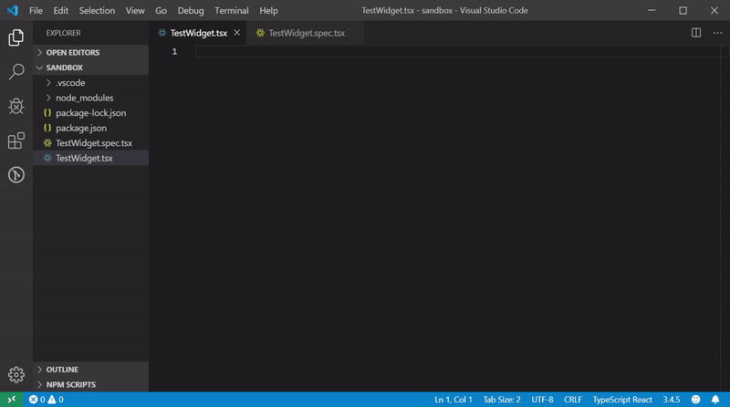

# Dojo Snippets for VS Code

This extension for Visual Studio Code adds snippets and supporting commands for Dojo 6+.

See the [CHANGELOG](CHANGELOG.md) for the latest changes

## Usage

Type part of a snippet, press `enter`, and the snippet unfolds.

Alternatively, press `Ctrl`+`Space` (Windows, Linux) or `Cmd`+`Space` (OSX) to activate snippets from within the editor.

### Command Palette Commands

| Command                              | Purpose                                                   |
| -------------------------------------| --------------------------------------------------------- |
| Dojo: Add i18n middleware            | Imports and configures i18n middleware for use            |
| Dojo: Add theme middleware           | Imports and configures theme middleware for use           |
| Dojo: Add block middleware           | Imports and configures block middleware for use           |
| Dojo: Add breakpoint middleware      | Imports and configures breakpoint middleware for use      |
| Dojo: Add cache middleware           | Imports and configures cache middleware for use           |
| Dojo: Add icache middleware          | Imports and configures icache middleware for use          |
| Dojo: Add focus middleware           | Imports and configures focus middleware for use           |
| Dojo: Add intersection middleware    | Imports and configures intersection middleware for use    |
| Dojo: Add resize middleware          | Imports and configures resize middleware for use          |
| Dojo: Add store middleware           | Imports and configures store middleware for use           |

### Commands

| Snippet                      | Purpose                                                      |
| ---------------------------- | ------------------------------------------------------------ |
| `d-widget`                   | widget                                                       |
| `d-widget-theme`             | widget with theme middleware                                 |
| `d-widget-i18n`              | widget with i18n middleware                                  |
| `d-widget-properties`        | widget with properties                                       |
| `d-middleware`               | middleware                                                   |
| `d-i18n-bundle`              | i18n bundle                                                  |
| `d-outlet`                   | outlet                                                       |
| `d-outlet-params`            | outlet with parameters                                       |
| `d-outlet-exact`             | outlet that renders only when route is exact                 |
| `d-routes`                   | routes file setup with root route                            |
| `d-route`                    | route                                                        |
| `d-route-children`           | route with children                                          |
| `d-command-factory`          | initialize processes file with command factory and imports   |
| `d-process`                  | process                                                      |
| `d-process-in-progress`      | process with in progress flag in state                       |
| `d-test-widget-intern-bdd`   | initialize Intern BDD test file for Dojo widget              |
| `d-test-widget-intern-object`| initialize Intern Object test file for Dojo widget           |
| `d-test-widget-jest`         | initialize Jest spec file for Dojo widget                    |
| `d-test-process-jest`        | initialize Jest spec file for Dojo process                   |

## Developing

## What's in here

* `package.json` - this is the manifest file that defines the location of the snippet files, specifies the language of the snippets, and what commands are available.
* `snippets/typescript.json` - the file containing all snippets available in `.ts` or `.tsx` files.
* `snippets/typescriptreact.json` - the file containing all snippets available only in `.tsx` files.
* `src/extension.ts` - the entry point for all commands.

### Get up and running straight away

* Press `F5` to open a new window with your extension loaded.
* Create a new file with a file name suffix matching your language.
* Verify that your snippets are proposed on intellisense.

### Make changes

* You can relaunch the extension from the debug toolbar after making changes to the files listed above.
* You can also reload (`Ctrl+R` or `Cmd+R` on Mac) the VS Code window with your extension to load your changes.
